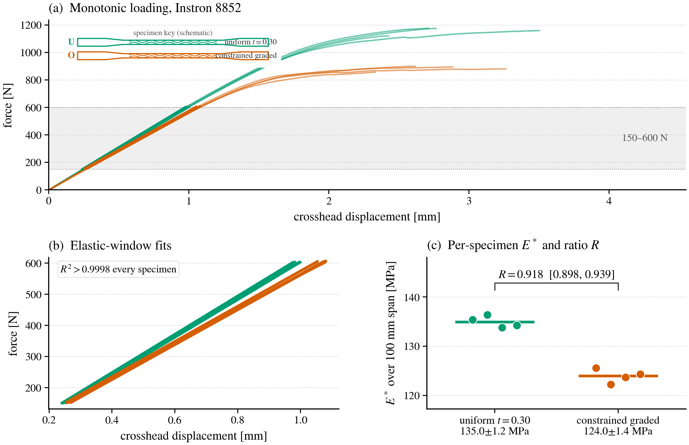

# Verification-guided mesh-free design optimization of graded TPMS metamaterials

Reproducibility materials for a study of analytic TPMS sheet geometry, deep-energy minimization (DEM), verification-guided thickness optimization, independent voxel finite-element (FE) checks, and PETG coupon measurements.



## What is included

- Analytic TPMS, DEM, optimization, and Code_Aster FE support code in `research/`.
- The eight archived Instron records and a deterministic statistical verifier in `validation/`.
- The data-asserting Figure 16 generator and publication assets in `paper/`.

The repository is a reproducibility snapshot, not a claim that every research-scale optimization or FE calculation is inexpensive to rerun on a laptop.

## Quick start

```bash
python -m venv .venv
python -m pip install -r requirements.txt
python validation/verify_experiment_stats.py
python paper/make_fig16_experimental.py
```

The first command recomputes the per-specimen moduli and all reported ratio intervals directly from the eight CSV files. The second recreates the experimental figure; it asserts plotted values against `validation/table8_results.json`.

## Repository map

```text
research/    Analytic geometry, DEM, optimization, and Code_Aster FE workflows
validation/  Raw Instron exports, experimental notes, and deterministic statistics
paper/       Figure generators, shared plotting style, and generated publication figures
docs/        Reproducibility tiers and execution notes
```

## Reproducibility and scope

See [docs/REPRODUCIBILITY.md](docs/REPRODUCIBILITY.md) for run tiers, dependencies, and interpretation limits. In particular, one uniform specimen (U1) was recorded at approximately 1 mm/min while the other records were at approximately 3 mm/min. The verifier therefore reports a transparent post hoc leave-U1-out sensitivity alongside the primary analysis; this does not repair the rate mismatch or single-build limitation.

## Citation

If this snapshot is useful, please cite the accompanying manuscript and this tagged release. A machine-readable record is available in [CITATION.cff](CITATION.cff).

```bibtex
@misc{el_sabea_2026_tpms,
  author = {El Sabea, Abdullah and Moj, Kevin and Kurek, Andrzej},
  title = {Verification-guided mesh-free design optimization of graded TPMS metamaterials},
  year = {2026},
  note = {Pre-submission reproducibility snapshot}
}
```

## License

Released under the [MIT License](LICENSE).
